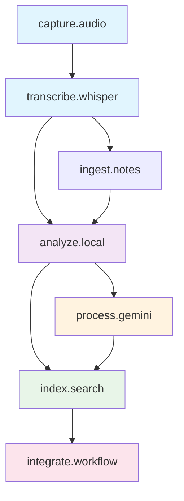

# TrojanHorse Development Roadmap

## 🎯 Project Vision

Transform the current MVP (audio capture + transcription) into a comprehensive AI-powered context capture and analysis system using local-first processing combined with selective cloud intelligence.

## 🏗️ AgentOS Architecture

Following the AgentOS methodology, each phase represents an autonomous agent with clear input/output contracts:



**Legend**:
- 🔵 **Existing**: Already implemented and working
- 🟣 **Phase 1**: Local privacy-first processing
- 🟠 **Phase 2**: Cloud-based advanced analysis
- 🟢 **Phase 3**: Search and indexing
- 🔴 **Phase 4**: Workflow integration

---

## **Phase 1: analyze.local** 
*Priority: Immediate (Next Sprint)*

### **Agent Specification**
- **Goal**: Privacy-first local content processing and sanitization
- **Inputs**: Raw transcripts from `transcribe.whisper` module
- **Outputs**: Classified, summarized, sanitized content ready for external APIs
- **Technology**: qwen3:8b via Ollama (local inference)
- **Privacy Boundary**: All sensitive data processing happens locally

### **Core Functions**
1. **Content Classification**
   - Meeting vs. thinking vs. phone call vs. dictation
   - Work vs. personal context identification
   - Urgency and importance scoring

2. **Privacy Protection**
   - PII detection and removal (names, phone numbers, addresses)
   - Sensitive topic identification (passwords, personal details)
   - Privacy scoring: Safe/Caution/Never-send-external

3. **Content Processing**
   - Key point extraction and summarization
   - Action item identification
   - Decision and conclusion tracking
   - Topic and project tagging

4. **Data Sanitization**
   - Anonymous summaries for external processing
   - Context preservation without sensitive details
   - Structured output for downstream agents

### **Technical Specifications**
- **Model**: qwen3:8b (optimal for 16GB M1 MacBook Pro)
- **RAM Usage**: ~6-8GB during processing
- **Processing Time**: <30 seconds per 5-minute transcript
- **Output Format**: Structured JSON with privacy metadata

### **Interface Contract**
```python
def process_transcript(transcript_file: Path) -> ProcessedContent:
    """
    Inputs: Raw transcript file from transcribe.whisper
    Outputs: ProcessedContent object with:
      - classification: ContentType
      - summary: str
      - action_items: List[str]
      - privacy_score: PrivacyLevel
      - sanitized_version: str
      - topics: List[str]
    """
```

---

## **Phase 2: process.gemini**
*Priority: High (Sprint 2)*

### **Agent Specification**
- **Goal**: Advanced analysis using Gemini Flash 2.0 for strategic insights
- **Inputs**: Sanitized content from `analyze.local`
- **Outputs**: Deep insights, strategic analysis, cross-day connections
- **Technology**: google/gemini-2.0-flash-001 via OpenRouter API
- **Cost Target**: <$5/month with efficient batching

### **Core Functions**
1. **Strategic Analysis**
   - Project progress tracking across conversations
   - Decision consistency and alignment checking
   - Goal progress and milestone identification

2. **Intelligence Synthesis**
   - Cross-day pattern recognition
   - Long-term thinking evolution tracking
   - Strategic recommendation generation

3. **Context Building**
   - Relationship mapping between ideas
   - Temporal analysis of thought development
   - Context synthesis for complex queries

### **Technical Specifications**
- **API**: OpenRouter (https://openrouter.ai/api/v1)
- **Model**: google/gemini-2.0-flash-001
- **Processing Time**: <10 seconds for sanitized summaries
- **Batch Size**: Process daily batches for efficiency
- **Rate Limiting**: 10 requests/minute with exponential backoff

### **Interface Contract**
```python
def analyze_content(sanitized_content: List[ProcessedContent]) -> AdvancedInsights:
    """
    Inputs: Batch of sanitized content from analyze.local
    Outputs: AdvancedInsights object with:
      - strategic_summary: str
      - project_updates: Dict[str, ProjectStatus]
      - recommendations: List[str]
      - cross_references: List[Connection]
      - long_term_patterns: List[Pattern]
    """
```

---

## **Phase 3: index.search**
*Priority: Medium (Sprint 3)*

### **Agent Specification**
- **Goal**: Fast retrieval and semantic search across all processed content
- **Inputs**: Outputs from both `analyze.local` and `process.gemini`
- **Outputs**: Search results, timeline views, contextual information
- **Technology**: SQLite with FTS5 + sentence-transformers embeddings
- **Performance**: <1 second for most searches

### **Core Functions**
1. **Full-Text Search**
   - Fast keyword search across all content
   - Boolean query support with filters
   - Date and time range filtering

2. **Semantic Search**
   - Vector similarity search using embeddings
   - Concept-based retrieval (not just keywords)
   - Related content suggestions

3. **Timeline Analysis**
   - Chronological view of topics and projects
   - Evolution tracking of ideas over time
   - Context building for historical queries

4. **Export Capabilities**
   - Structured data export (JSON, CSV)
   - Integration-ready formats
   - Backup and migration support

### **Technical Specifications**
- **Database**: SQLite with FTS5 full-text search
- **Embeddings**: all-MiniLM-L6-v2 (384-dimensional vectors)
- **Storage**: ~1GB per year of daily usage
- **Indexing**: Real-time updates with batch optimization

### **Database Schema**
```sql
-- Core content table
CREATE TABLE content (
    id INTEGER PRIMARY KEY,
    date DATE,
    timestamp DATETIME,
    content_type TEXT,  -- meeting, thinking, call, etc.
    raw_transcript TEXT,
    local_summary TEXT,
    gemini_insights TEXT,
    privacy_score INTEGER,  -- 1-10
    topics JSON,
    action_items JSON,
    created_at DATETIME
);

-- Full-text search
CREATE VIRTUAL TABLE content_fts USING fts5(
    local_summary, 
    gemini_insights, 
    topics,
    content=content
);

-- Vector embeddings for semantic search
CREATE TABLE embeddings (
    content_id INTEGER,
    embedding BLOB,  -- 384-dimensional vector
    FOREIGN KEY(content_id) REFERENCES content(id)
);
```

---

## **Phase 4: integrate.workflow**
*Priority: Low (Sprint 4+)*

### **Agent Specification**
- **Goal**: Real-time context injection and workflow automation
- **Inputs**: Search results + current context queries
- **Outputs**: Contextual assistance, automated actions, proactive insights
- **Technology**: CLI tools, REST API, macOS notifications
- **Integration**: Productivity tools and workflow automation

### **Core Functions**
1. **Context-Aware Queries**
   - "What did I decide about project X last week?"
   - "Show me all action items from this month"
   - "What were my thoughts on the budget proposal?"

2. **Proactive Assistance**
   - Daily summary generation
   - Weekly pattern analysis
   - Reminder system for follow-ups

3. **Export Integration**
   - Obsidian note generation
   - Notion database updates
   - Task manager integration

4. **Real-Time Decision Support**
   - Context injection for current conversations
   - Historical perspective on recurring topics
   - Consistency checking for decisions

---

## **🔧 Technical Implementation Details**

### **Configuration Management**
```yaml
# config.yaml
analyze:
  local:
    model: "qwen3:8b"
    endpoint: "http://localhost:11434"
    privacy_threshold: 8  # 1-10 scale
    processing_mode: "batch"  # batch or streaming
    max_concurrent: 2
  
processing:
  gemini:
    provider: "openrouter"
    model: "google/gemini-2.0-flash-001"
    api_key_env: "OPENROUTER_API_KEY"
    max_tokens: 8192
    temperature: 0.1
    batch_size: 10
    cost_limit_monthly: 5.00  # USD

database:
  path: "context.db"
  enable_fts: true
  embedding_model: "all-MiniLM-L6-v2"
  retention_days: 365
  backup_enabled: true
  backup_frequency: "weekly"

workflow:
  cli_enabled: true
  api_port: 8080
  notifications: true
  integrations:
    obsidian: false
    notion: false
```

### **Privacy Architecture**
- **Always Local**: Raw transcripts, PII, personal relationships
- **Sanitized for API**: Topic summaries, anonymized decisions, general insights
- **Never External**: Names, phone numbers, passwords, specific personal details
- **Privacy Scoring**: 1-10 scale with threshold-based routing

### **Error Handling & Resilience**
- **Graceful Degradation**: Each agent can operate independently
- **Retry Logic**: Exponential backoff for API calls
- **Fallback Modes**: Local-only processing when API unavailable
- **Health Monitoring**: Integration with existing health_monitor.py

### **Performance Optimization**
- **Batch Processing**: Group operations for efficiency
- **Caching**: Local cache for frequent queries
- **Lazy Loading**: Load embeddings and models on demand
- **Memory Management**: Cleanup after processing batches

---

## **📋 Implementation Timeline**

### **Sprint 1 (Week 1-2): Phase 1 Foundation**
- Set up Ollama with qwen3:8b model
- Implement local content processing pipeline
- Build privacy filtering and sanitization
- Create structured output format

### **Sprint 2 (Week 3-4): Phase 2 Intelligence**
- OpenRouter API integration
- Gemini Flash 2.0 processing pipeline
- Batch processing and cost optimization
- Advanced analysis capabilities

### **Sprint 3 (Week 5-6): Phase 3 Memory**
- SQLite database with FTS5 setup
- Embedding generation and storage
- Search interface implementation
- Timeline and export features

### **Sprint 4 (Week 7-8): Phase 4 Integration**
- CLI interface for queries
- Workflow automation features
- Integration with existing tools
- Performance optimization and testing

---

## **🎛️ Success Metrics**

### **Phase 1 Metrics**
- **Privacy Protection**: 99%+ PII detection accuracy
- **Processing Speed**: <30 seconds per 5-minute transcript
- **Content Quality**: >80% useful action items identified

### **Phase 2 Metrics**
- **API Costs**: <$5/month for daily usage
- **Insight Quality**: User satisfaction with strategic analysis
- **Processing Speed**: <10 seconds for sanitized content analysis

### **Phase 3 Metrics**
- **Search Performance**: <1 second for 95% of queries
- **Storage Efficiency**: <1GB per year of content
- **Retrieval Accuracy**: >90% relevant results for semantic search

### **Phase 4 Metrics**
- **User Adoption**: Daily usage of context features
- **Workflow Integration**: Successful export to productivity tools
- **Decision Support**: Measurable improvement in context awareness

---

## **🔒 Security & Privacy Considerations**

### **Data Classification**
1. **Public**: General topics, sanitized summaries
2. **Internal**: Work projects, business decisions (sanitized)
3. **Confidential**: Personal details, sensitive business information
4. **Restricted**: PII, passwords, private conversations

### **Privacy Controls**
- Local processing for all sensitive content
- Configurable privacy thresholds
- User review before external API calls
- Complete audit trail of data sharing

### **Security Measures**
- API key management via environment variables
- Local database encryption at rest
- Secure communication with external APIs
- Regular security audits and updates

---

This roadmap provides a comprehensive foundation for building out the complete TrojanHorse system while maintaining privacy, performance, and user control.